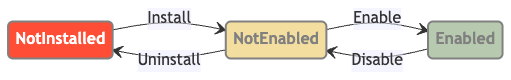

import TabItem from '@theme/TabItem'
import Tabs from '@theme/Tabs'

# App Lifecycle

## Overview

The ONES Open Platform application lifecycle management system provides a comprehensive framework for managing app installation, configuration, and operation. This ensures secure and controlled deployment of applications within ONES organizations through standardized callback mechanisms and JWT-based authentication.

## Lifecycle States



Applications in the ONES platform go through the following lifecycle state transformations:

1. **Install**: App is deployed and integrated with the organization
2. **Enable**: App becomes active and operational, all capabilities are available
3. **Disable**: App is temporarily deactivated but remains installed, all capabilities are unavailable
4. **Uninstall**: App is completely removed from the organization

## Lifecycle Callback Configuration

### Manifest Declaration

The `lifecycle_callback` configuration is part of your app's own manifest (app metadata and behavior), not runtime-only platform settings.

Use different manifest sections based on the hosting model:

| Hosting Model         | Config File     | `lifecycle_callback` Location  |
| --------------------- | --------------- | ------------------------------ |
| **ONES hosted**       | `opkx.json`     | `app.lifecycle_callback`       |
| **Externally hosted** | `manifest.json` | Top-level `lifecycle_callback` |

<Tabs groupId="hosting-model">
  <TabItem value="ones-hosted" label="ONES hosted" default>
For **ONES hosted** apps, configure callbacks in `opkx.json` under the `app` section:
See more details: [Hosted App](./ones-hosted-app/manifest)

```json title="opkx.json"
{
  "app": {
    "lifecycle_callback": {
      "install": "/install_cb",
      "enabled": "/enabled_cb",
      "disabled": "/disabled_cb",
      "uninstalled": "/uninstalled_cb"
    }
  }
}
```

  </TabItem>
  <TabItem value="externally-hosted" label="Externally hosted">

For **Externally hosted** apps, configure callbacks in `manifest.json`:
See more details: [Externally Hosted App](./externally-hosted-app/)

```json title="manifest.json"
{
  "lifecycle_callback": {
    "install": "/install_cb",
    "enabled": "/enabled_cb",
    "disabled": "/disabled_cb",
    "uninstalled": "/uninstalled_cb"
  }
}
```

  </TabItem>
</Tabs>

### Callback Fields

> **Note**
> The `install` callback affects the app installation process in ONES, while other callbacks do not impact the lifecycle status.

| Field Name    | Required | Type   | Description                 |
| ------------- | -------- | ------ | --------------------------- |
| `install`     | Yes      | string | Installation callback URL   |
| `enabled`     | No       | string | Enablement callback URL     |
| `disabled`    | No       | string | Disablement callback URL    |
| `uninstalled` | No       | string | Uninstallation callback URL |

### URL Requirements

- All callback URLs must be relative paths starting with `/`
- Maximum length: 256 characters
- Must be accessible endpoints within your application
- Should implement proper error handling and validation

## HTTP Headers

The following headers will be included in the HTTP callbacks from ONES:

| Header            | Required | Description                                                  | Example                                          |
| ----------------- | -------- | ------------------------------------------------------------ | ------------------------------------------------ |
| `Content-Type`    | Yes      | Request body format                                          | `application/json`                               |
| `X-Ones-Trace-Id` | Yes      | Request tracing ID for debugging                             | `32c430a06a8411ef9f0cbfe18ab3b83a`               |
| `Authorization`   | No       | [JWT](./app-security/#jwt-authentication) for authentication | `Bearer eyJhbGciOiJIUzI1NiIsInR5cCI6IkpXVCJ9...` |

:::info Authorization Header

- **Installation callback**: Authorization header is **empty** (not present)
- **Other callbacks** (enabled/disabled/uninstalled): Authorization header from ONES contains a JWT for authentication. You should verify the JWT using the shared secret for security
  :::

**Authorization Header Format:**

```
Authorization: Bearer <JWT_TOKEN>
```

## Installation Callback

The installation callback is triggered when an app is first installed in an organization. This is the most critical callback as it establishes the secure communication channel between your app and ONES.

### Callback Trigger Scenarios

The installation callback is triggered in the following scenarios:

:::important
In all scenarios below, a new shared secret will be generated and provided to your app.
:::

| Scenario               | Description                                                                                                                                                                                                                                                               |
| ---------------------- | ------------------------------------------------------------------------------------------------------------------------------------------------------------------------------------------------------------------------------------------------------------------------- |
| **First Installation** | First time installing the app in an organization.                                                                                                                                                                                                                         |
| **Manual/Auto Update** | When the app version changes from the current installation record. For **Externally hosted** apps, updating the app's manifest URL also triggers this scenario. If the app installation status is enabled, ONES will trigger both the installation and enabled callbacks. |

**Example Request Body:**

```json
{
  "installation_id": "install_123e4567e89b12d3a456426614174000",
  "org_id": "DPbJ77Xr",
  "ones_base_url": "https://ones.example.com",
  "shared_secret": "YTMyYzQzMGEwNmE4NDExZWY5ZjBjYmZlMThhYjNiODM=",
  "callback_type": "install",
  "time_stamp": 1718868300000,
  "app": {
    "id": "app_k8m2x7n9p5w3z1q6",
    "version": "v1.0.4"
  }
}
```

### Request Structure

| Field Name        | Type   | Required | Description                                   |
| ----------------- | ------ | -------- | --------------------------------------------- |
| `installation_id` | string | Yes      | App installation ID (generated by ONES)       |
| `org_id`          | string | Yes      | ONES organization ID                          |
| `ones_base_url`   | string | No       | ONES instance base URL                        |
| `shared_secret`   | string | Yes      | JWT signing secret (base64 encoded, 32 bytes) |
| `callback_type`   | string | Yes      | Callback type, always "install"               |
| `time_stamp`      | number | Yes      | Unix timestamp (milliseconds)                 |
| `app.id`          | string | Yes      | App ID for this request                       |
| `app.version`     | string | Yes      | App version for this request                  |

### Response Requirements

:::important
Your installation endpoint **MUST** return HTTP status code `200` to complete the installation successfully.
:::

### Installation Callback Failure Handling

The installation callback uses a **simple retry strategy**, which is critical for the installation process:

- **Timeout**: 10 seconds per request
- **Retry Attempts**: 1 additional retry (total of 2 attempts)
- **Failure Impact**: The above attempts are unsuccessful

#### Retryable Conditions (Will Retry)

- **Network Timeouts**: Connection or request timeout (>10 seconds)
- **HTTP 429**: Too Many Requests (rate limiting)
- **HTTP 5xx**: All server errors (500-599)

#### Non-Retryable Conditions (Permanent Failure)

- **HTTP 2xx**: Success responses (process completes without retry)
- **HTTP 4xx**: Client errors (400-499, except 429), including:
  - `400 Bad Request`
  - `401 Unauthorized`
  - `403 Forbidden`
  - `404 Not Found`
  - `422 Unprocessable Entity`
  - Other 4xx errors

### Implementation Example

```javascript
app.post('/install_cb', (req, res) => {
  const {
    installation_id,
    org_id,
    ones_base_url,
    shared_secret,
    callback_type,
    time_stamp,
    app
  } = req.body;

  // Store the shared_secret securely for JWT verification
  await storeAppCredentials({
    installationId: installation_id,
    orgId: org_id,
    sharedSecret: shared_secret,
    onesBaseUrl: ones_base_url
  });

  // Initialize app data for this organization
  await initializeAppData({
    installationId: installation_id,
    orgId: org_id,
    appId: app.id,
    appVersion: app.version
  });

  res.status(200).json({
    message: 'App installed successfully'
  });
});
```

:::warning Important Implementation Requirements

- **Secure Secret Storage**: The `shared_secret` must be stored securely as it's required for JWT verification
- **Proper Error Handling**: Return appropriate HTTP error responses if installation fails
- **Comprehensive Logging**: Log installation events for monitoring and debugging purposes
  :::

## Enable/Disable/Uninstall Callbacks

These callbacks are triggered when an app's lifecycle state changes. And will NOT affect the overall application lifecycle process in ONES. Even if your callback fails or returns an error, the app's state change will still proceed successfully.

### Request Structure

| Field Name        | Type   | Required | Description                                                                  |
| ----------------- | ------ | -------- | ---------------------------------------------------------------------------- |
| `installation_id` | string | Yes      | App installation ID                                                          |
| `callback_type`   | string | Yes      | Callback type: "enabled", "disabled", or "uninstalled"                       |
| `time_stamp`      | number | Yes      | Unix timestamp (milliseconds)                                                |
| `app.id`          | string | Yes      | App ID from app manifest (`manifest.json` or `opkx.json` `app` section)      |
| `app.version`     | string | Yes      | App version from app manifest (`manifest.json` or `opkx.json` `app` section) |

**Example Request Body:**

```json
{
  "installation_id": "install_123e4567e89b12d3a456426614174000",
  "callback_type": "enabled",
  "time_stamp": 1718868300000,
  "app": {
    "id": "app_k8m2x7n9p5w3z1q6",
    "version": "v1.0.4"
  }
}
```

### Response Requirements

:::info
These callback endpoints should return HTTP status code `200` or `204` to indicate successful processing.
:::

### Callback Retry Rules

For retryable conditions, ONES uses **exponential backoff**:

> **Note**: Unlike the the **simple retry strategy** used by the [installation callback](#installation-callback-failure-handling), this exponential backoff is designed for general retryable conditions, providing more flexibility with increasing delays.

- **Initial delay**: 3 seconds
- **Multiplier**: 3x (3s → 9s → 27s → 60s → 60s...)
- **Maximum interval**: 60 seconds
- **Total retry time**: 300 seconds (5 minutes)

### Simple Implementation Example

```javascript title="enabled_cb.js"
app.post('/enabled_cb', (req, res) => {
  const { installation_id, app, callback_type, time_stamp } = req.body;

  // Activate app services for this installation
  await enableAppServices(installation_id);

  // Resume any scheduled tasks or background processes
  await resumeScheduledTasks(installation_id);

  res.status(200).json({
    message: 'App enabled successfully'
  });
});
```

```javascript title="disabled_cb.js"
app.post('/disabled_cb', (req, res) => {
  const { installation_id, app, callback_type, time_stamp } = req.body;

  // Temporarily disable app services
  await disableAppServices(installation_id);

  // Pause scheduled tasks but preserve data
  await pauseScheduledTasks(installation_id);

  res.status(200).json({
    message: 'App disabled successfully'
  });
});
```

```javascript title="uninstalled_cb.js"
app.post('/uninstalled_cb', (req, res) => {
  const { installation_id, app, callback_type, time_stamp } = req.body;

  // Clean up app data (consider data retention policies)
  await cleanupAppData(installation_id);

  // Remove stored credentials
  await removeAppCredentials(installation_id);

  // Cancel any active subscriptions or services
  await cancelActiveServices(installation_id);

  res.status(200).json({
    message: 'App uninstalled successfully'
  });
});
```

### Handling Out-of-Order Callbacks

:::warning Different callbacks to your app may arrive out of order.
With poor network conditions or frequent lifecycle operations, for example, when an admin enables an app:

1. ONES sends an `enabled` callback to your app
2. Due to network issues or slow app processing, the `enabled` callback fails and will be retried
3. Admin clicks "Disable" at this time, ONES sends a `disabled` callback
4. Your app may receive multiple callback types in this sequence:
   - `enabled` (first request, network delay, but eventually arrives)
   - `disabled` (succeeds)
   - `enabled` (ONES retry for the failed first request, but app is now disabled)

**Important:** The `time_stamp` in the `enabled` request will be earlier than the `disabled` request.
:::

You can choose between two strategies to handle duplicate and out-of-order callbacks:

1. **Timestamp-based filtering**: Discard callbacks with older timestamps than your current state
2. **Idempotency**: Design callbacks to be safe to execute multiple times

#### Strategy 1: Timestamp-Based Filtering

Discard callbacks with timestamps older than your current state:

```javascript title="timestamp_filtering.js"
app.post('/enabled_cb', async (req, res) => {
  const { installation_id, callback_type, time_stamp } = req.body

  // Get current app state
  const currentState = await getAppState(installation_id)

  // Discard outdated callbacks
  if (currentState && time_stamp <= currentState.last_updated) {
    console.log(`Discarding outdated ${callback_type} callback`)
    return res.status(200).json({ message: 'Callback discarded (outdated)' })
  }

  // Update state with new timestamp
  await updateAppState(installation_id, {
    status: callback_type,
    last_updated: time_stamp,
  })

  // Perform state change
  await enableAppServices(installation_id)

  res.status(200).json({ message: 'App enabled successfully' })
})
```

#### Strategy 2: Idempotency

Design callbacks to be safe to execute multiple times:

```javascript title="idempotent_callbacks.js"
app.post('/enabled_cb', async (req, res) => {
  const { installation_id, callback_type, time_stamp } = req.body

  // Always safe to call - check current state and act accordingly
  const currentState = await getAppState(installation_id)

  if (currentState?.status === 'enabled') {
    // Already enabled, nothing to do
    return res.status(200).json({ message: 'App already enabled' })
  }

  // Enable services (idempotent operation)
  await enableAppServices(installation_id)
  await updateAppState(installation_id, {
    status: 'enabled',
    last_updated: time_stamp,
  })

  res.status(200).json({ message: 'App enabled successfully' })
})
```

## Security Considerations

- Store `shared_secret` values using encryption at rest (see [Token Storage and Management](../advanced/app-security.mdx#token-storage-and-management))
- Use secure key management systems in production
- Never log secret values in plain text

## Troubleshooting

### Common Issues

1. **Callback Timeouts**: Ensure callbacks complete within 10 seconds
2. **Secret Storage Failures**: Verify database connectivity and permissions
3. **JWT Verification Errors**: Make sure you had decoded the `shared_secret` before using it for verifying the JWT
4. **Duplicate Installations**: Implement proper idempotency checks

### Debug Tips

1. Enable detailed logging for all lifecycle events
2. Validate request payloads against expected schemas
3. Test callback endpoints independently using tools like Postman
4. Monitor callback response times and error rates
