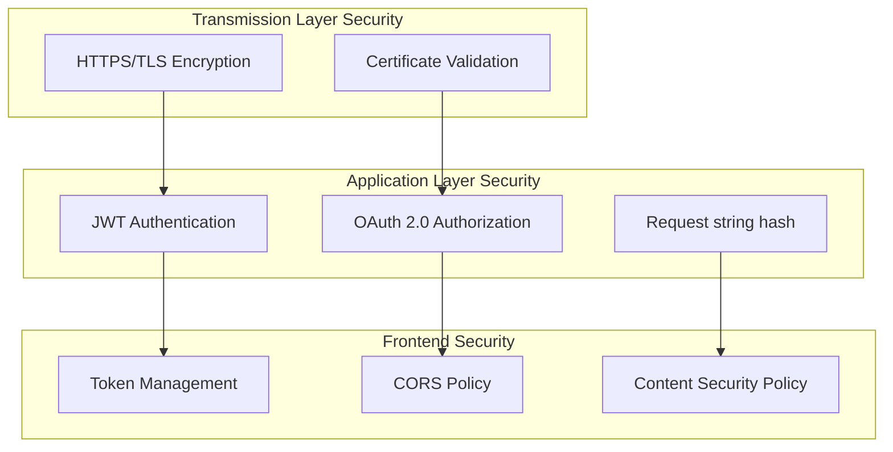

# App Security

The ONES Open Platform implements a comprehensive security framework to protect applications and data through multiple layers of security controls. This framework ensures secure communication, proper authentication, and robust authorization mechanisms for all app interactions.

## Security Architecture

The ONES platform security model consists of three primary layers:



## Communication Security

### HTTPS Requirements

All communication between ONES platform and applications must use HTTPS for production environments.

#### Protocol Configuration

| Environment | Protocol | Certificate | Validation |
| ----------- | -------- | ----------- | ---------- |
| Production  | HTTPS    | Valid SSL   | Required   |
| Development | HTTP     | Self-signed | Optional   |

#### Implementation Example

```javascript
// Configure HTTPS for production
if (process.env.NODE_ENV === 'production') {
  const https = require('https')
  const fs = require('fs')

  const options = {
    key: fs.readFileSync('private-key.pem'),
    cert: fs.readFileSync('certificate.pem'),
  }

  https.createServer(options, app).listen(443)
} else {
  app.listen(3000)
}
```

### Certificate Management

#### Production Requirements

1. **Valid SSL Certificate**: Use certificates issued by trusted Certificate Authorities
2. **Certificate Chain**: Include complete certificate chain in configuration
3. **Renewal Process**: Implement automated certificate renewal
4. **Security Headers**: Configure proper security headers

```javascript
// Security headers configuration
app.use((req, res, next) => {
  res.setHeader('Strict-Transport-Security', 'max-age=31536000; includeSubDomains')
  res.setHeader('X-Content-Type-Options', 'nosniff')
  res.setHeader('X-Frame-Options', 'DENY')
  res.setHeader('X-XSS-Protection', '1; mode=block')
  next()
})
```

## JWT Authentication

JWT tokens provide signed proof that a callback truly comes from ONES and carries untampered request context; without validation, attackers could spoof requests or relay stale payloads into your app.

ONES issues JWTs for lifecycle callbacks (enabled, disabled, uninstalled), event webhooks, and capability extensions such as manhour validators—any integration surface where ONES pushes data into your service.

### Token Structure

JWT Format: `<Header>.<Claims>.<Signature>`

### JWT Claims Description

| Field | Type   | Required | Description                                                                                                                                                                                                  |
| ----- | ------ | -------- | ------------------------------------------------------------------------------------------------------------------------------------------------------------------------------------------------------------ |
| `iat` | int64  | Yes      | Issued at time - Unix timestamp when the token was generated                                                                                                                                                 |
| `exp` | int64  | Yes      | Expiration time - Unix timestamp when token expires (max 300 seconds for callbacks, 1 day for others)                                                                                                        |
| `aud` | string | Yes      | Audience - App ID as defined in the app manifest                                                                                                                                                             |
| `sub` | string | Yes      | Subject - App installation ID for this specific installation                                                                                                                                                 |
| `iss` | string | No       | ONES base URL - The base address ONES provides for app access. May be empty if not applicable. If empty, use the default base URL provided by the ONES platform or contact the administrator for assistance. |
| `uid` | string | No       | User ID - ONES user ID when the token represents a real user context                                                                                                                                         |
| `rsh` | string | No       | Request string hash - Hash of request parameters to prevent tampering                                                                                                                                        |

:::info Request string hash (rsh)
The `rsh` field contains a hash of the request method, path, and query parameters to ensure request integrity. ONES generates this hash when making callback requests, and apps can verify it to enhance security against request tampering. See [Request String Hash](#request-string-hash) section below for detailed implementation.
:::

```json title="Example/Token Structure"
Header: {
  "alg": "HS256",
  "typ": "JWT"
}

Claims: {
  "iat": 1735680000,    // Issued at timestamp (Unix seconds)
  "exp": 1735680300,    // Expiration timestamp (max 300 seconds for callbacks, 1 day for others)
  "aud": "string",      // App ID from manifest
  "sub": "string",      // App installation ID
  "iss": "string",      // ONES base URL
  "uid": "string",      // ONES user ID (optional, for user context)
  "rsh": "string"       // Request string hash (optional, for request integrity)
}
```

### Token Verification

Use the `shared_secret` from the installation callback to verify incoming JWTs.

:::important
The `shared_secret` is base64 encoded in the callback. The app should decode it before using it for verifying the JWT.
:::

#### Simple Token Verification Example

```javascript
const jwt = require('jsonwebtoken')

function simpleVerifyToken(token, installationId) {
  // Get shared secret for this installation
  const sharedSecret = getStoredSecret(installationId)

  // Decode base64 encoded secret
  const decodedSecret = Buffer.from(sharedSecret, 'base64')

  // Verify and decode token
  const decoded = jwt.verify(token, decodedSecret)

  return decoded
}

// Usage in callback endpoint
app.post('/enabled_cb', (req, res) => {
  const token = req.get('Authorization')?.replace('Bearer ', '')
  const { installation_id } = req.body

  try {
    const claims = simpleVerifyToken(token, installation_id)
    console.log('Token verified for installation:', claims.sub)

    // Process your callback logic here
    res.status(200).json({ status: 'success' })
  } catch (error) {
    console.error('Token verification failed:', error.message)
    res.status(401).json({ error: 'Unauthorized' })
  }
})
```

#### Production-Ready Token Verification

For production environments, use comprehensive validation with security checks:

```javascript
const crypto = require('crypto')

function verifyToken(token, installationId, req) {
  try {
    // Step 1: Retrieve shared_secret for this app instance
    const sharedSecret = getStoredSecret(installationId)
    if (!sharedSecret) {
      throw new Error('Shared secret not found for installation')
    }

    // Step 2: Decode base64 encoded shared secret
    const decodedSecret = Buffer.from(sharedSecret, 'base64')

    // Step 3: Verify token signature and decode claims
    const decoded = jwt.verify(token, decodedSecret, {
      algorithms: ['HS256'], // Only allow HMAC SHA256
      clockTolerance: 5, // Allow 5 seconds clock skew
    })

    // Step 4: Validate required claims
    validateClaims(decoded, installationId, req)

    return decoded
  } catch (error) {
    console.error('JWT verification failed:', error.message)
    throw new Error(`Token verification failed: ${error.message}`)
  }
}

function validateClaims(claims, expectedInstallationId, req) {
  const now = Math.floor(Date.now() / 1000)

  // Check required fields
  if (!claims.iat) {
    throw new Error('Missing issued at time (iat)')
  }
  if (!claims.exp) {
    throw new Error('Missing expiration time (exp)')
  }
  if (!claims.aud) {
    throw new Error('Missing audience (aud)')
  }
  if (!claims.sub) {
    throw new Error('Missing subject (sub)')
  }

  // Validate installation ID matches
  if (claims.sub !== expectedInstallationId) {
    throw new Error('Installation ID mismatch')
  }

  // Validate audience (should be your app ID)
  if (claims.aud !== process.env.APP_ID) {
    throw new Error('Invalid audience')
  }

  // Validate token timing (additional check beyond jwt.verify)
  if (claims.iat > now + 5) {
    throw new Error('Token issued in the future')
  }

  if (claims.exp < now - 5) {
    throw new Error('Token expired')
  }

  // Validate token lifetime (callbacks should have max 300 seconds)
  const tokenLifetime = claims.exp - claims.iat
  if (tokenLifetime > 300) {
    throw new Error('Token lifetime too long for callback')
  }

  // Validate optional request string hash
  if (claims.rsh) {
    if (!req) {
      throw new Error('Request context required for RSH validation')
    }

    const method = req.method.toUpperCase()
    const path = req.path
    const queryString = new URLSearchParams(req.query).toString()
    const signaturePayload = `${method}:${path}:${queryString}`
    const computedHash = crypto.createHash('sha256').update(signaturePayload).digest('hex')

    if (computedHash !== claims.rsh) {
      throw new Error('Request string hash mismatch')
    }
  }
}

// Enhanced usage example with error handling
function handleCallbackWithAuth(req, res) {
  try {
    const authHeader = req.get('Authorization')
    if (!authHeader) {
      return res.status(401).json({
        error: 'Missing Authorization header',
      })
    }

    // Remove Bearer prefix
    const token = authHeader.replace(/^Bearer\s+/, '')
    if (!token) {
      return res.status(401).json({
        error: 'Invalid Authorization header format',
      })
    }

    // Extract installation ID from request body for validation
    const { installation_id } = req.body
    if (!installation_id) {
      return res.status(400).json({
        error: 'Missing installation_id in request body',
      })
    }

    // Verify JWT
    const claims = verifyToken(token, installation_id, req)

    console.log('Token verified successfully:', {
      installationId: claims.sub,
      audience: claims.aud,
      tokenLifetime: claims.exp - claims.iat,
    })

    // Add claims to request for use in route handler
    req.jwt = claims
    req.installationId = claims.sub

    // Continue with callback processing
    processCallback(req, res)
  } catch (error) {
    console.error('Callback authentication failed:', error.message)

    // Return appropriate error status
    if (error.message.includes('expired')) {
      return res.status(401).json({ error: 'Token expired' })
    } else if (error.message.includes('signature')) {
      return res.status(401).json({ error: 'Invalid token signature' })
    } else {
      return res.status(401).json({ error: 'Authentication failed' })
    }
  }
}

function processCallback(req, res) {
  // Your callback logic here
  res.status(200).json({ status: 'success' })
}
```

### Token Storage and Management

#### Secure Secret Storage

```javascript
const crypto = require('crypto')

// Encrypt secrets at rest
function encryptSecret(secret, encryptionKey) {
  const cipher = crypto.createCipher('aes-256-gcm', encryptionKey)
  let encrypted = cipher.update(secret, 'utf8', 'hex')
  encrypted += cipher.final('hex')
  const tag = cipher.getAuthTag().toString('hex')
  return `${encrypted}:${tag}`
}

function decryptSecret(encryptedSecret, encryptionKey) {
  const [encrypted, tag] = encryptedSecret.split(':')
  const decipher = crypto.createDecipher('aes-256-gcm', encryptionKey)
  decipher.setAuthTag(Buffer.from(tag, 'hex'))
  let decrypted = decipher.update(encrypted, 'hex', 'utf8')
  decrypted += decipher.final('utf8')
  return decrypted
}
```

## Frontend Security

### CORS Configuration

#### Architecture Overview

ONES uses a micro-frontend architecture for frontend extensions, with the data flow: **ONES Frontend to Application**. This approach was chosen after comprehensive evaluation of performance, security, implementation cost, and stability factors:

- **Micro-frontend Framework**: ONES has established frontend sandbox and event mechanisms, achieving isolation between application frontend and standard product frontend
- **Cross-domain Solution**: Independent application deployment inevitably faces cross-domain issues, and [CORS](https://developer.mozilla.org/docs/Web/HTTP/Guides/CORS) is a universal solution
- **High Trust Level**: App installation is initiated by organization administrators, making applications highly trusted programs
- **Security Assurance**: ONES to Application communication includes Authorization header to support application verification of request legitimacy, providing basic security guarantee

#### Backend CORS Setup

Each HTTP request from the browser (ONES Frontend) to the server (App Backend) must be allowed by CORS.
This can be done by setting the `Access-Control-Allow-Origin` header in the response.

```javascript
const cors = require('cors')

// Configure CORS in your app backend
const corsOptions = {
  origin: function (origin, callback) {
    // Allow ONES domains
    const allowedOrigins = [
      'https://ones.example.com',
      // Allow that origin which ONES organization is installed your app in ONES instance.
    ]

    if (
      !origin ||
      allowedOrigins.some((allowed) => {
        if (typeof allowed === 'string') return allowed === origin
        return allowed.test(origin)
      })
    ) {
      callback(null, true)
    } else {
      callback(new Error('Not allowed by CORS'))
    }
  },
  credentials: true,
  optionsSuccessStatus: 200,
}

app.use(cors(corsOptions))
```

#### Frontend CORS Handling

For frontend requests, prefer using the Web SDK helper which handles authentication and context automatically. See [ONES.fetchApp](../../abilities/web-sdk/fetch-app.mdx) for usage details and examples.

```javascript
import { ONES } from '@ones-open/web-sdk'

ONES.fetchApp('/app/metadata')
```

### Content Security Policy

```javascript
// Set comprehensive CSP headers
app.use((req, res, next) => {
  res.setHeader(
    'Content-Security-Policy',
    [
      "default-src 'self'",
      "script-src 'self' 'unsafe-inline' https://ones.example.com",
      "style-src 'self' 'unsafe-inline' https://fonts.googleapis.com",
      "font-src 'self' https://fonts.gstatic.com",
      "img-src 'self' data: https:",
      "connect-src 'self' https://api.ones.example.com",
      "frame-ancestors 'none'",
      "base-uri 'self'",
      "form-action 'self'",
    ].join('; '),
  )

  next()
})
```

### Runtime Information Security (Browser)

To protect organization and user data, the runtime environment of frontend extensions applies strict information security restrictions while running in the browser sandbox.

#### Global Object Isolation

The `window` and `document` objects are proxy objects that provide controlled access to browser APIs. Additionally, `window.parent` and `window.top` both point to the current window itself, ensuring isolation from the parent frame context.

#### Relative Path Handling

When making API calls, all relative paths are resolved using the sandbox's HTML address as the baseURI:

```javascript
// Network request APIs
fetch(url, options) // URL will be rewritten as absolute path based on baseURI
navigator.sendBeacon(url, data) // URL will be rewritten as absolute path based on baseURI
new XMLHttpRequest().open(method, url) // URL will be rewritten as absolute path based on baseURI
new EventSource(url) // URL will be rewritten as absolute path based on baseURI

// Image resources
img.src = url
```

When requesting resources (including dynamically created resources), all relative paths are resolved using the sandbox's HTML address as the baseURI:

```html
<!-- HTML resource references -->
<link href="style.css" rel="stylesheet" />
<script src="script.js"></script>

<video src="video.mp4"></video>
```

```css
@font-face {
  src: url('font.woff2');
}
```

All relative paths are resolved based on the sandbox's baseURI.

#### DOM Node Tree Isolation

The DOM node tree is isolated within the sandbox container with property overrides and query redirection:

**Property Overrides**

```javascript
// Document structure points to sandbox container
document.documentElement // Returns sandbox's html element
document.head // Returns sandbox's head element
document.body // Returns sandbox's body element
document.activeElement // Returns sandbox's body element
document.scrollingElement // Returns sandbox's body element
```

**Node Element Query Isolation**

```javascript
// Query methods redirected to sandbox container
document.querySelector(selector) // Queries within sandbox container
document.querySelectorAll(selector) // Queries within sandbox container
document.getElementsByTagName(tag) // Queries within sandbox container
document.getElementsByTagNameNS(ns, tag) // Queries within sandbox container
document.getElementById(id) // Queries within sandbox container
document.getElementsByName(name) // Queries within sandbox container
```

**Node Element Relationship Isolation**

```javascript
node.parentNode // If sandbox html, returns sandbox's document object
node.parentElement // If sandbox html, returns null
node.offsetParent // Returns sandbox element, sandbox's body, or null
```

#### Style Isolation

All CSS styles, whether from network requests, HTML style tags, or dynamically created style tags, are automatically scoped to the sandbox to prevent affecting the host's styles:

```html
<!-- Network-requested CSS files -->
<link href="style.css" rel="stylesheet" />

<!-- HTML style tags -->
<style>
  .my-class {
    color: red;
  }
</style>
```

```javascript
// Dynamically created style tags
const style = document.createElement('style')
style.innerHTML = '.my-class { color: blue; }'
```

All styles are automatically scoped for isolation.

#### ONES Data Isolation

To ensure ONES data isolation:

**IndexedDB API Scoping**

The IndexedDB API is scoped to prevent access to ONES data.

**Storage Access Restrictions**

```javascript
// These storage APIs are disabled and cannot read or write data
localStorage // Cannot read or write
sessionStorage // Cannot read or write
document.cookie // Cannot read or write
window.name // Cannot read or write
```

#### ONES Environment Isolation

To ensure ONES environment isolation, the sandbox cannot access or manipulate the `location` and `history` objects:

```javascript
// These APIs are restricted and cannot modified
location // Cannot modify
history // Cannot modify
```

## Troubleshooting Security Issues

### Common Security Problems

1. **Token Verification Failures**

   - Check shared secret encoding (base64)
   - Verify token expiration handling
   - Validate audience and issuer claims

2. **CORS Rejections**

   - Verify origin domain configuration
   - Check preflight request handling
   - Confirm credential settings

3. **Certificate Issues**
   - Validate certificate chain
   - Check certificate expiration
   - Verify domain name matching

### Debugging Tools

```javascript
// Security debugging middleware
function securityDebugger(req, res, next) {
  if (process.env.NODE_ENV === 'development') {
    console.log('Security Debug:', {
      method: req.method,
      url: req.url,
      origin: req.get('Origin'),
      authorization: req.get('Authorization') ? 'Present' : 'Missing',
      contentType: req.get('Content-Type'),
    })
  }
  next()
}

app.use(securityDebugger)
```

## Request String Hash

Request String Hash (RSH) is a mechanism for verifying the integrity of HTTP requests between ONES and your app. When a request passes through intermediary services, compute the request hash for tamper-proof transit.

### Why We Need RSH

- **JWT signs only the claims**: It guarantees integrity for the token payload (`sub`, `aud`, etc.), but not for the HTTP method, path, or query parameters that can still be manipulated in transit.
- **RSH binds request-line details**: By hashing the method, URI, and query string, RSH ensures the request that arrives is exactly the one ONES issued—even if proxies rewrite URLs or inject parameters.
- **Prevents replay and route swapping**: Attackers cannot reuse a valid JWT against a different endpoint or with altered filters because the hashed request context must match.
- **Layered defense**: JWT authenticates who sent the request; RSH safeguards what was sent. Together they provide end-to-end assurance of authenticity and integrity.

### When to Use RSH

RSH is especially valuable in the following scenarios:

- **Lifecycle callbacks**: Validate that ONES lifecycle callback payloads have not been modified by proxies or middleware before they reach your service.
- **Event webhooks**: Confirm that event notifications delivered through the ONES event system arrive unchanged, even when routed through intermediate relays.
- **Capability extensions**: Safeguard capability-specific callbacks (for example, manhour validators or other extension points) against tampering with targeted resource identifiers.

### RSH Generation Algorithm

The RSH generation process transforms the Method, URI, and Query parameters from the request:

#### 1. Process HTTP Method

Convert the HTTP method to uppercase:

```javascript
const method = req.method.toUpperCase()
```

#### 2. Process URI

Process the URI with the following rules:

- Use the relative path from the base URL, must start with '/'
- If the URI contains '&', it will be escaped as %26

```javascript
let uri = req.uri
// Ensure URI starts with '/'
if (!uri.startsWith('/')) {
  uri = '/' + uri
}
// Escape & symbols
uri = uri.replace(/&/g, '%26')
```

#### 3. Process Query Parameters

Process query parameters with these rules:

- URL encode both parameter keys and values (skip if key is 'jwt')
- Join encoded key and value with '='
- Sort by parameter key first (if a key has multiple values, sort the values as well)
- Join all parameters with ',' comma

```javascript
const queryParts = []

for (const [key, val] of Object.entries(req.query)) {
  // Skip jwt parameter
  if (key === 'jwt') {
    continue
  }

  const escapedKey = encodeURIComponent(key)

  // Handle single or multiple values
  let values
  if (Array.isArray(val)) {
    values = val
  } else {
    values = [val]
  }

  // Sort multiple values for the same key
  values.sort()

  for (const value of values) {
    const escapedValue = encodeURIComponent(value)
    queryParts.push(`${escapedKey}=${escapedValue}`)
  }
}

// Sort parameters by key
queryParts.sort()
const query = queryParts.join(',')
```

#### 4. Build Request Context (req_context)

Concatenate the three processed components using '&':

```javascript
const reqContext = `${method}&${uri}&${query}`
```

#### 5. Calculate SHA256 Hash

Compute the SHA256 hash of the request context and convert to hexadecimal string:

```javascript
import crypto from 'crypto';

const hash = crypto.createHash('sha256').update(reqContext).digest('hex');
return hash;
```

### RSH Validation Process

On the server side, RSH validation is included in the JWT verification flow:

#### 1. JWT Verification

First verify the JWT in the request:

```javascript
const authHeader = req.headers['authorization']
if (!authHeader || !authHeader.startsWith('Bearer ')) {
  throw new Error('Missing or invalid Authorization header')
}
const tokenStr = authHeader.replace('Bearer ', '')
const claims = verifyJWT(tokenStr, sharedSecret)
```

#### 2. RSH Validation

If the JWT claims contain an `rsh` field, perform RSH validation:

```javascript
if (claims.rsh && claims.rsh !== '') {
  const expectedRSH = computeRSH(req)
  if (!expectedRSH) {
    throw new Error('RSH compute error')
  }
  if (claims.rsh !== expectedRSH) {
    throw new Error('RSH mismatch')
  }
}
```

#### 3. RSH Computation Implementation

Server-side RSH computation implementation:

```javascript
import crypto from 'crypto'
import { URL } from 'url'

function computeRSH(req) {
  const method = req.method.toUpperCase()
  const urlObj = new URL(req.url, `http://${req.headers.host}`)
  let uri = urlObj.pathname

  // Handle & symbols in URI
  uri = uri.replace(/&/g, '%26')

  // Process Query parameters
  const queryParts = []
  for (const [key, values] of urlObj.searchParams.entries()) {
    if (key === 'jwt') {
      continue // Skip jwt parameter
    }

    const escapedKey = encodeURIComponent(key)
    const valueArray = Array.isArray(values) ? values : [values]
    valueArray.sort() // Sort multiple values

    for (const value of valueArray) {
      const escapedVal = encodeURIComponent(value)
      queryParts.push(`${escapedKey}=${escapedVal}`)
    }
  }

  queryParts.sort() // Sort parameters
  const queryStr = queryParts.join(',')

  // Concatenate request context
  const reqContext = `${method}&${uri}&${queryStr}`

  // Calculate SHA256
  const hash = crypto.createHash('sha256').update(reqContext).digest('hex')
  return hash
}
```

### RSH Example

Given the following HTTP request:

```
GET /api/v1/projects?status=active&type=web&type=mobile&jwt=eyJ0eXAiOiJKV1QiLCJhbGciOiJIUzI1NiJ9...
```

RSH calculation process:

1. **Method**: `GET`
2. **URI**: `/api/v1/projects`
3. **Query Processing**:
   - Filter out `jwt` parameter
   - `status=active`
   - `type=mobile,type=web` (multiple values sorted)
   - Parameter sorting: `status=active,type=mobile,type=web`
4. **Request Context**: `GET&/api/v1/projects&status=active,type=mobile,type=web`
5. **SHA256**: Calculate SHA256 hash of the above string

#### JavaScript Implementation Example

```javascript
import crypto from 'crypto'

function generateRSH(method, uri, queryParams) {
  // 1. Convert method to uppercase
  const processedMethod = method.toUpperCase()

  // 2. Escape & symbols in URI
  const processedUri = uri.replace(/&/g, '%26')

  // 3. Process query parameters
  const queryParts = []

  for (const [key, value] of Object.entries(queryParams)) {
    // Skip jwt parameter
    if (key === 'jwt') continue

    const escapedKey = encodeURIComponent(key)

    // Handle single or multiple values
    const values = Array.isArray(value) ? value : [value]

    // Sort multiple values
    values.sort()

    for (const val of values) {
      const escapedValue = encodeURIComponent(val)
      queryParts.push(`${escapedKey}=${escapedValue}`)
    }
  }

  // Sort parameters and join with commas
  queryParts.sort()
  const query = queryParts.join(',')

  // 4. Build request context
  const reqContext = `${processedMethod}&${processedUri}&${query}`

  // 5. Calculate SHA256
  return crypto.createHash('sha256').update(reqContext).digest('hex')
}

// Example usage
const rsh = generateRSH('GET', '/api/v1/projects', {
  status: 'active',
  type: ['web', 'mobile'],
  jwt: 'eyJ0eXAiOiJKV1QiLCJhbGciOiJIUzI1NiJ9...',
})

console.log('RSH:', rsh)
// Request context: GET&/api/v1/projects&status=active,type=mobile,type=web
// Output:
// RSH: 80e7f6b966cc71c08502a935930b82fd44498799dae2c6ad71a8c765cad1a5a1
```

#### Golang Implementation Example

```go
package main

import (
    "crypto/sha256"
    "encoding/hex"
    "fmt"
    "net/url"
    "sort"
    "strings"
)

func generateRSH(method, uri string, queryParams map[string]interface{}) (string, error) {
    // 1. Convert method to uppercase
    processedMethod := strings.ToUpper(method)

    // 2. Ensure URI starts with '/' and escape & symbols
    processedURI := uri
    if !strings.HasPrefix(processedURI, "/") {
        processedURI = "/" + processedURI
    }
    processedURI = strings.ReplaceAll(processedURI, "&", "%26")

    // 3. Process query parameters
    var queryParts []string
    for key, val := range queryParams {
        // Skip jwt parameter
        if key == "jwt" {
            continue
        }

        escapedKey := url.QueryEscape(key)

        // Handle single or multiple values
        var values []string
        switch v := val.(type) {
        case string:
            values = []string{v}
        case []string:
            values = v
        case []interface{}:
            for _, item := range v {
                values = append(values, fmt.Sprintf("%v", item))
            }
        default:
            values = []string{fmt.Sprintf("%v", v)}
        }

        // Sort multiple values for the same key
        sort.Strings(values)

        for _, value := range values {
            escapedValue := url.QueryEscape(value)
            queryParts = append(queryParts, escapedKey+"="+escapedValue)
        }
    }

    // Sort parameters by key
    sort.Strings(queryParts)
    query := strings.Join(queryParts, ",")

    // 4. Build request context
    reqContext := processedMethod + "&" + processedURI + "&" + query

    // 5. Calculate SHA256
    hash := sha256.Sum256([]byte(reqContext))
    return hex.EncodeToString(hash[:]), nil
}

func main() {
    // Example usage
    rsh, err := generateRSH("GET", "/api/v1/projects", map[string]interface{}{
        "status": "active",
        "type":   []string{"web", "mobile"},
        "jwt":    "eyJ0eXAiOiJKV1QiLCJhbGciOiJIUzI1NiJ9...",
    })

    if err != nil {
        fmt.Printf("Error: %v\n", err)
        return
    }

    fmt.Printf("RSH: %s\n", rsh)
    // Request context: GET&/api/v1/projects&status=active,type=mobile,type=web
    // Output:
    // RSH: 80e7f6b966cc71c08502a935930b82fd44498799dae2c6ad71a8c765cad1a5a1
}
```

### Important Notes

- RSH validation is optional and only performed when the JWT claims contain an `rsh` field
- The `jwt` parameter is automatically excluded when calculating RSH
- Parameter value sorting and escaping rules must be strictly followed, otherwise validation will fail
- The `&` symbol in URI must be escaped as `%26`

## Security Compliance

### Data Protection Requirements

- Encrypt sensitive data at rest and in transit
- Implement proper access controls and audit logs
- Follow data retention and deletion policies
- Comply with regional privacy regulations

### Security Monitoring

```javascript
// Security event monitoring
function logSecurityEvent(type, details) {
  const event = {
    timestamp: new Date().toISOString(),
    type: type,
    details: details,
    severity: getSeverityLevel(type),
  }

  // Send to security monitoring system
  securityMonitor.log(event)

  // Alert on high-severity events
  if (event.severity === 'HIGH') {
    alertingSystem.notify(event)
  }
}
```
